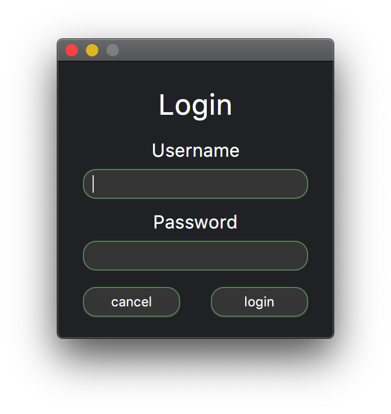
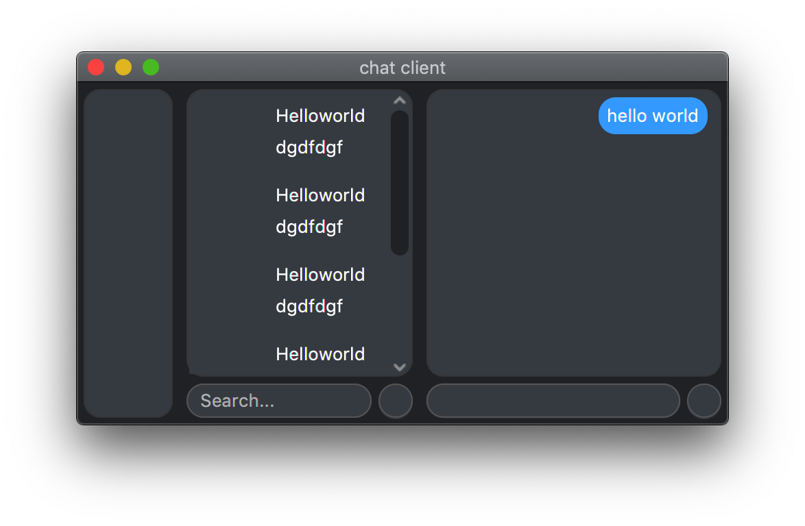

# java-chat-client

this will be a simplistic chat client 
with the ability to send and receive messages to users over th internet.

it will send messages through a central server 
that will only store details about where messages 
are to be sent, and permissions for the user on the server

#Dependencies
* JavaFx - used for the User interface
* java 13 - the jdk we are using
* gradle - the build system we are using

# images
#### the login window

#### the main window with contant

*this may not reflect the actual interface at all times as it can be changed*

#Owners
@michael-bailey
@mitch161
